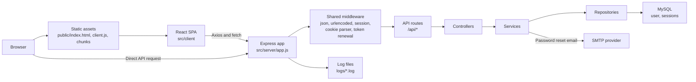
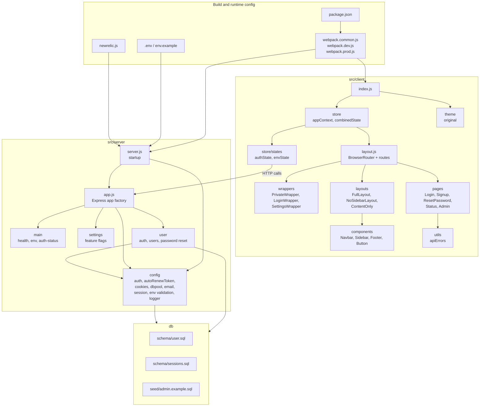
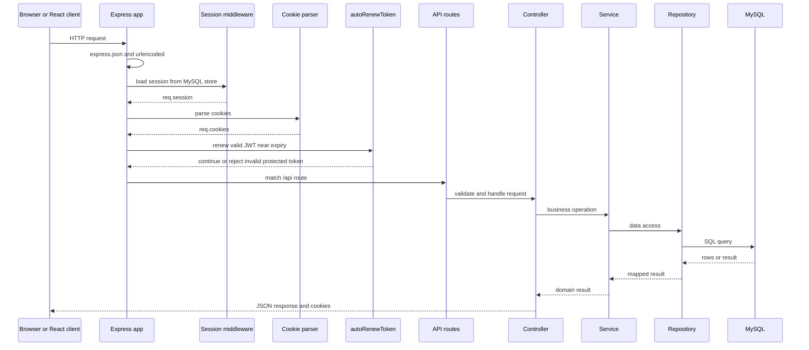
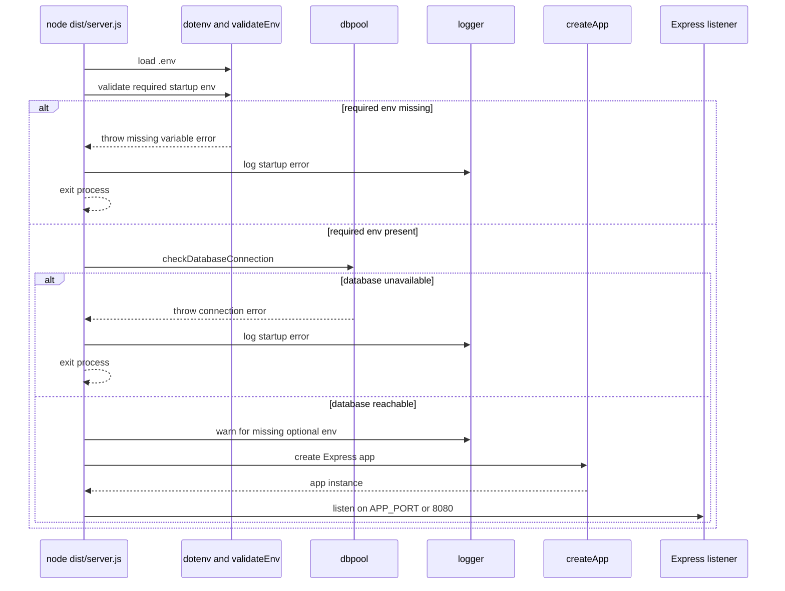
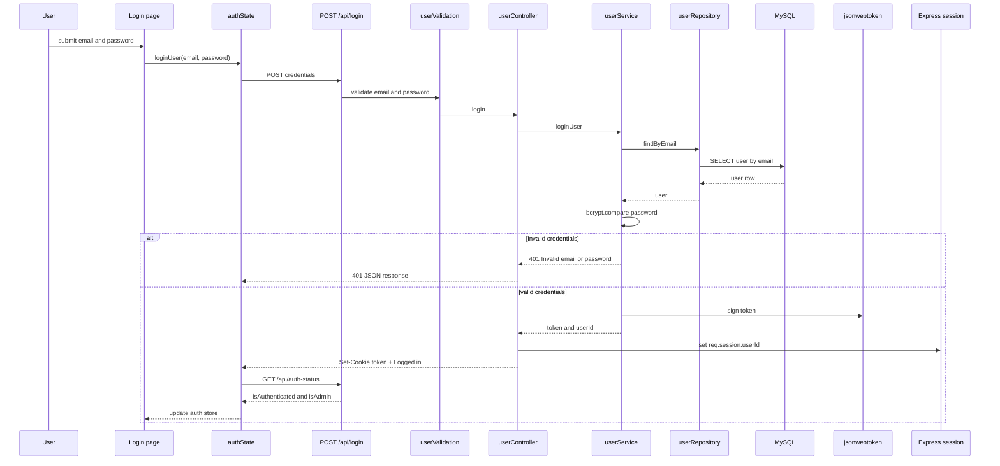
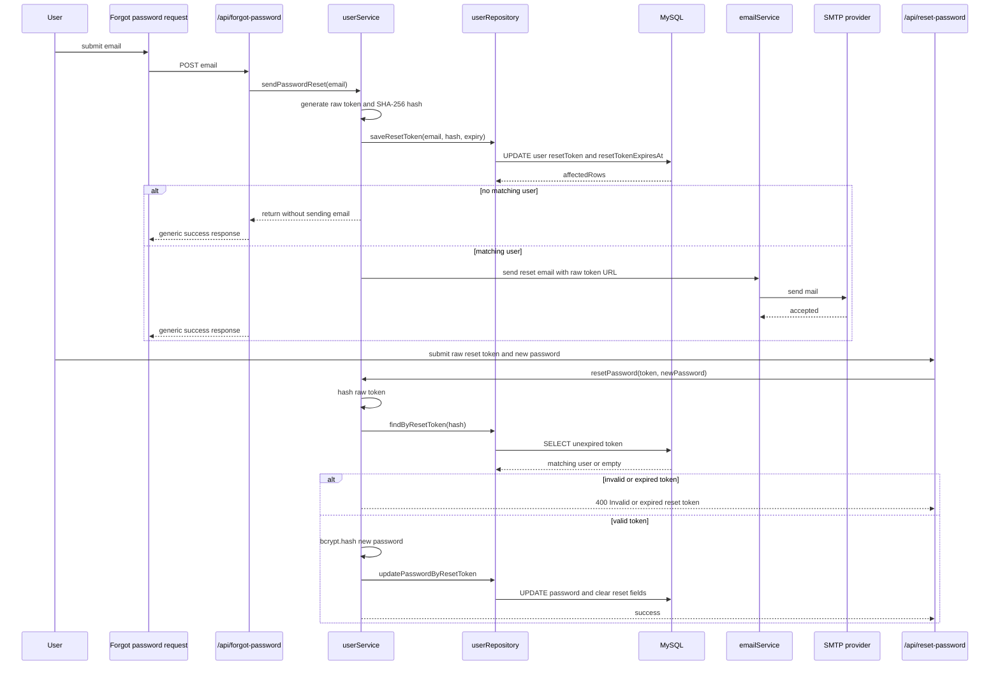
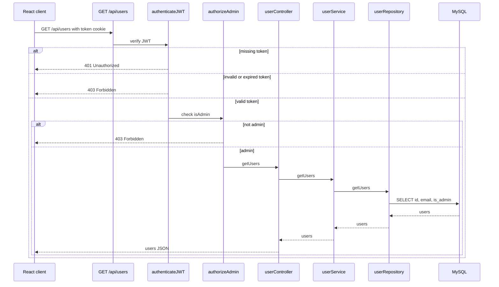

# Architecture Maps

This document uses Mermaid diagrams to describe the project structure and the main runtime flows. GitHub renders Mermaid diagrams directly in Markdown.

## Runtime Architecture

## Module Map

## Server Request Pipeline

## Startup Flow

## Login Flow

## Password Reset Flow

## Protected Admin Users Flow

## How To Keep These Current

- Update the architecture diagram when a new external dependency, persistence layer, or runtime boundary is added.
- Update the module map when new top-level client or server modules are added.
- Update sequence diagrams when request middleware order, controller/service/repository contracts, or auth behavior changes.
